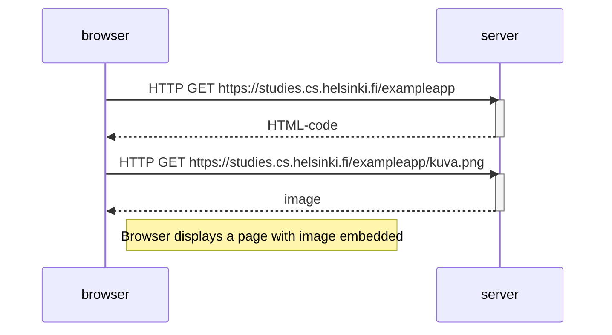
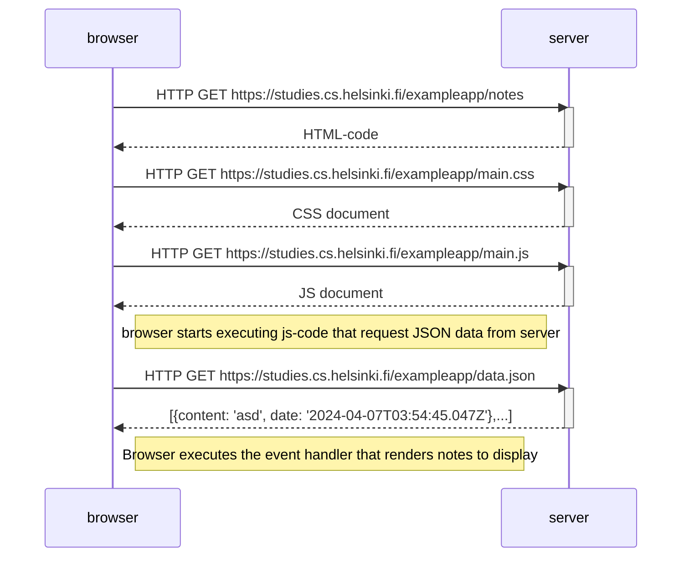
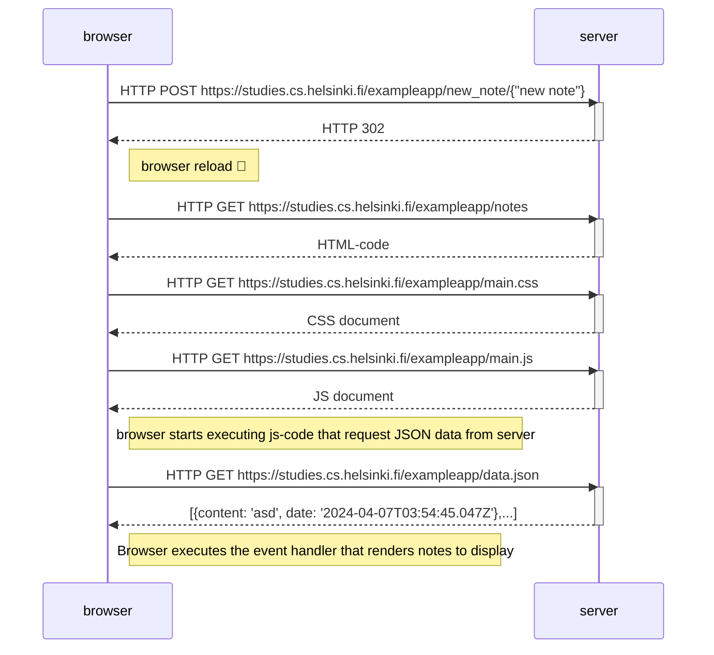
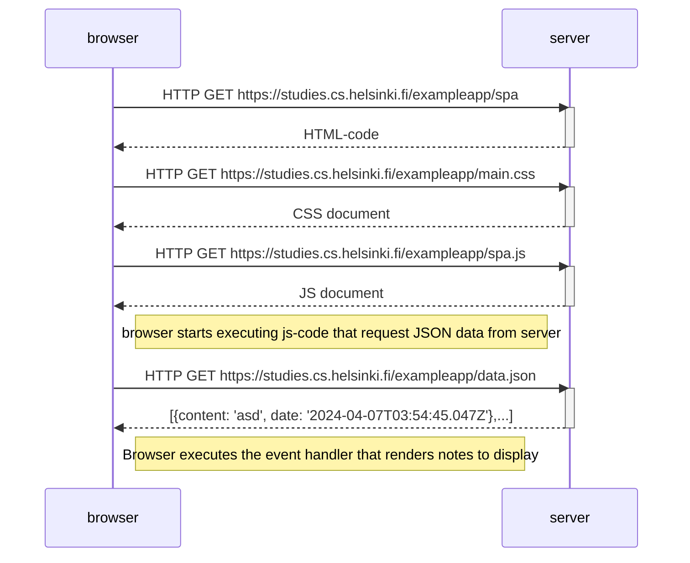
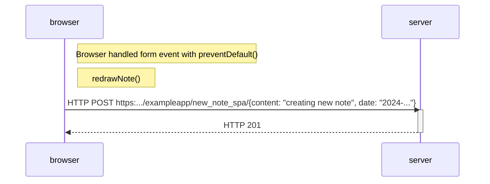

## First example page

```mermaid

sequenceDiagram
    participant browser
    participant server

    browser->>server: HTTP GET https://studies.cs.helsinki.fi/exampleapp
    activate server
    server-->>browser: HTML-code
    deactivate server

    browser->>server: HTTP GET https://studies.cs.helsinki.fi/exampleapp/kuva.png
    activate server
    server-->>browser: image
    deactivate server

    Note right of browser: Browser displays a page with image embedded
    %% This is a comment %%

```

## Traditional web applications

```mermaid
sequenceDiagram
    participant browser
    participant server

    browser->>server: HTTP GET https://studies.cs.helsinki.fi/exampleapp/notes
    activate server
    server-->>browser: HTML-code
    deactivate server

    browser->>server: HTTP GET https://studies.cs.helsinki.fi/exampleapp/main.css
    activate server
    server-->>browser: CSS document
    deactivate server

    browser->>server: HTTP GET https://studies.cs.helsinki.fi/exampleapp/main.js
    activate server
    server-->>browser: JS document
    deactivate server

    Note right of browser: browser starts executing js-code that request JSON data from server
    %% on the browser both request occur at the same time %%

    browser->>server: HTTP GET https://studies.cs.helsinki.fi/exampleapp/data.json
    activate server
    server-->>browser: [{content: 'asd', date: '2024-04-07T03:54:45.047Z'},...]
    deactivate server

    Note right of browser: Browser executes the event handler that renders notes to display
    %% This is a comment %%
```

## 0.4 -- Creating a new note

```mermaid
sequenceDiagram
    participant browser
    participant server

    browser->>server: HTTP POST https://studies.cs.helsinki.fi/exampleapp/new_note/{"new note"}
    activate server
    server-->>browser: HTTP 302
    deactivate server

    Note right of browser: browser reload 🔄

    browser->>server: HTTP GET https://studies.cs.helsinki.fi/exampleapp/notes
    activate server
    server-->>browser: HTML-code
    deactivate server

    browser->>server: HTTP GET https://studies.cs.helsinki.fi/exampleapp/main.css
    activate server
    server-->>browser: CSS document
    deactivate server

    browser->>server: HTTP GET https://studies.cs.helsinki.fi/exampleapp/main.js
    activate server
    server-->>browser: JS document
    deactivate server

    Note right of browser: browser starts executing js-code that request JSON data from server
    %% on the browser both request occur at the same time %%

    browser->>server: HTTP GET https://studies.cs.helsinki.fi/exampleapp/data.json
    activate server
    server-->>browser: [{content: 'asd', date: '2024-04-07T03:54:45.047Z'},...]
    deactivate server

    Note right of browser: Browser executes the event handler that renders notes to display
    %% This is a comment %%
```

## 0.5 -- SPA (Single Page App) 

```mermaid
sequenceDiagram
    participant browser
    participant server

    browser->>server: HTTP GET https://studies.cs.helsinki.fi/exampleapp/spa
    activate server
    server-->>browser: HTML-code
    deactivate server

    browser->>server: HTTP GET https://studies.cs.helsinki.fi/exampleapp/main.css
    activate server
    server-->>browser: CSS document
    deactivate server

    browser->>server: HTTP GET https://studies.cs.helsinki.fi/exampleapp/spa.js
    activate server
    server-->>browser: JS document
    deactivate server

    Note right of browser: browser starts executing js-code that request JSON data from server


    browser->>server: HTTP GET https://studies.cs.helsinki.fi/exampleapp/data.json
    activate server
    server-->>browser: [{content: 'asd', date: '2024-04-07T03:54:45.047Z'},...]
    deactivate server

    Note right of browser: Browser executes the event handler that renders notes to display
    %% This is a comment %%
```

## 0.6 -- SPA creating new note 

```mermaid

sequenceDiagram
    participant browser
    participant server


    Note right of browser: Browser handled form event with preventDefault()
    Note right of browser: redrawNote()

    browser->>server: HTTP POST https:.../exampleapp/new_note_spa/{content: "creating new note", date: "2024-..."}
    activate server
    server-->>browser: HTTP 201
    deactivate server

    

```